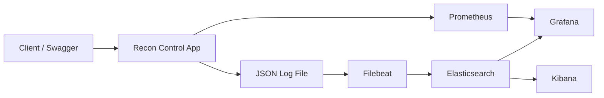

# Faz 4 Advanced Observability Stack

## Goal
Add a professional local observability stack that covers both metrics and
logs.

## Data Flow

## Roles
- Prometheus: scrapes application metrics
- Grafana: dashboards for metrics and logs
- Elasticsearch: stores indexed logs
- Kibana: explores indexed logs
- Filebeat: ships JSON log files into Elasticsearch

## Why It Matters In Banking
Banking backends are incident-heavy and audit-sensitive. Teams need to:
- search logs quickly by correlation id
- inspect request rates and JVM pressure in dashboards
- connect errors, transactions, and user actions across systems
