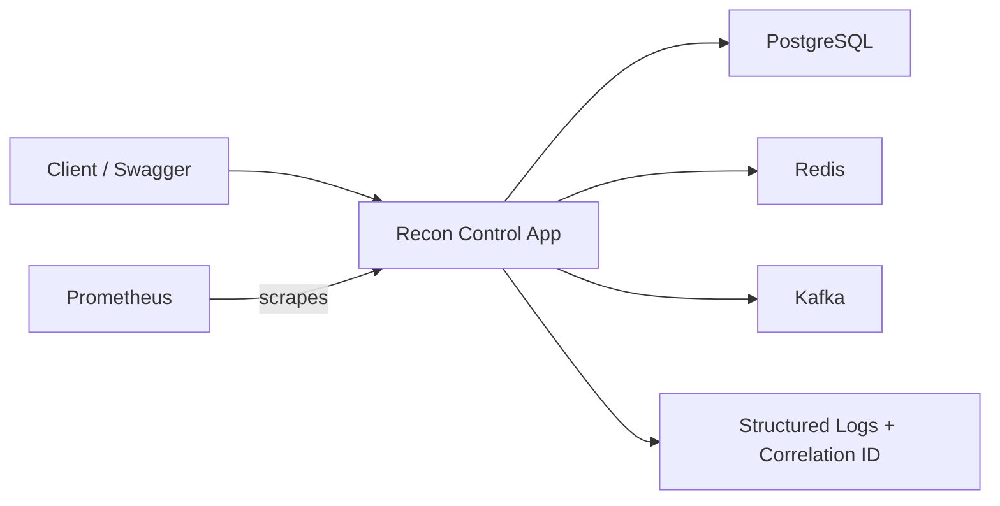

# Faz 4 Production Readiness Overview

## Goal
Turn the event-driven banking backend into a production-like runnable
service with observability, containerization, and CI discipline.

## Runtime Flow

## What Faz 4 Adds
- container packaging through a multi-stage Dockerfile
- production-like local runtime through Docker Compose
- Actuator health and metrics endpoints
- Prometheus scraping
- correlation-id propagation on every HTTP request
- structured JSON logs in docker profile
- CI build validation

## Why It Matters In Banking
Production readiness is critical in banking because service behavior must
be explainable under load, during incidents, and during audits.

This phase improves:
- operational visibility
- deployment consistency
- incident debugging speed
- change safety through CI
